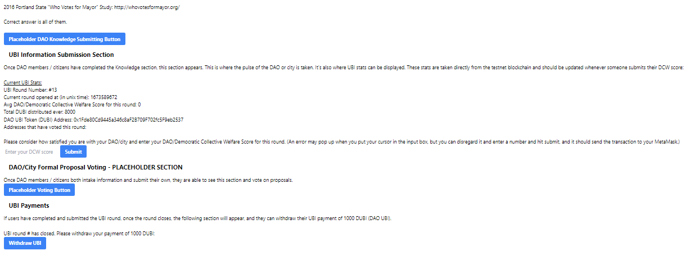

<a name="readme-top"></a>

<!-- TABLE OF CONTENTS -->
<details>
  <summary>Table of Contents</summary>
  <ol>
    <li><a href="#about-the-project">About The Project</a></li>
    <li><a href="#development-stack-and-plugins">Development Stack and Plugins</a></li>
    <li><a href="#cli-and-interaction-steps">CLI and Interaction Steps</a></li>
    <li><a href="#usage">Usage Notes</a></li>
    <li><a href="#future-considerations">Future Considerations</a></li>
    <li><a href="#lessons-learned">Lessons Learnedd</a></li>
    <li><a href="#contributing">Contributing</a></li>
    <li><a href="#license">License</a></li>
    <li><a href="#contact">Contact</a></li>
    <li><a href="#acknowledgments">Acknowledgments</a></li>
  </ol>
</details>

<!-- ABOUT THE PROJECT -->

## About The Project

The Universal Basic Information (UBI) Dashboard is an on-chain, hive-mind repository that pays DAO members to provide data that governs the organization ultimately through smart contracts. After being proven in DAOs, the system and process flow can be scaled to cities. As our world systems become more complex, information symmetry will play a bigger role, and community data coordination will be one of the most valuable public goods. So why not pay each other for it?

This repo doubles as a proof of concept and a portfolio project. Please see the Future Considerations section for production features and functionality to add that will enhance the robustness (<i>gross</i>) of the dApp and user experience and really like, collectively, bring it all home for people. For more regarding the greater context of how such a UBI system could benefit DAOs and cities, please read this series on Medium:

Article 1: [Digital Symmetry Coursing Through the Network City](https://medium.com/@ArmandDaigle/digital-symmetry-coursing-through-the-network-city-51f06c0c77e5)

Article 2: [DAO Voter Turnout and Other Impossible Feats of Humankind](https://medium.com/@ArmandDaigle/dao-voter-turnout-and-other-impossible-feats-of-humankind-756a27bbedfc)

Article 3: [Universal Basic Information: Mining the Renewable Public Good](https://medium.com/@ArmandDaigle/universal-basic-information-mining-the-renewable-public-good-d6a86bb0d489)

Article 4: [The Universal Basic Information Dashboard Framework](https://medium.com/@ArmandDaigle/the-universal-basic-information-dashboard-framework-8eef9544c175)

<br>

<b>Project Links</b>

[Back End Github Repository](https://github.com/Starmand6/ubi-dashboard)

[Front End Github Repository](https://github.com/Starmand6/ubi-dashboard-front-end)

<u>Contract Deployment Addresses</u>

- [UBI Dashboard Contract Page](https://goerli.etherscan.io/address/0xb73142c2b34bc3bfadc3c140bcb1fe5aa68cc941#code) on Goerli Etherscan. The Contract address is: ```0xB73142c2b34Bc3BFadc3c140BCb1FE5aA68cC941```
- [DAO UBI Token (DUBI) Contract Page](https://goerli.etherscan.io/address/0x1Fde80Cd9445a346c8aF2B709F702fc5F9eb2537#code) on Goerli Etherscan. The contract address is: ```0x1Fde80Cd9445a346c8aF2B709F702fc5F9eb2537```

<u>UBI Dashboard Live dApp</u>

## [UBI Dashboard LIVE dApp](https://misty-art-7284.on.fleek.co/)
<p>

To connect with the live dApp, switch your MetaMask wallet to the Goerli testnet (here's a [how-to guide](https://blog.cryptostars.is/goerli-g%C3%B6rli-testnet-network-to-metamask-and-receiving-test-ethereum-in-less-than-2-min-de13e6fe5677) on adding it to MetaMask if needed). You will need testnet Ether to interact with the contract. You can get some at this lovely [faucet](https://goerlifaucet.com/). After that, you should be all set. Remember, for testing and portfolio purposes, anyone can open and close the rounds, which enables and disables certain functions, so if someone else is accessing it at the same time, you may get errors when trying to interact with the dApp. You can also go to the Goerli Etherscan contract pages listed above and interact with the contracts there via the "Read Contract" and "Write Contract" buttons. The getter links under "Read Contract" should always work no matter if someone else is opening or closing rounds.


- UBI Participant Prerequisites: 
    - In a production build, users must be a DAO member or Citizen (but again, for this testnet dApp, anyone can register and participate.)
    - In a production build, in order to be eligible to withdraw UBI, users must have participated in at least 70% of the UBI rounds that have occured since they first voted. This has not been implemented, so testers do not have to be in good standing to withdraw UBI.

- UBIToken.sol Contract Functionality:
    - There are really only two ways for the public to interact with this contract, and I'll save you the effort. Since the UBI Dashboard contract is the owner of the UBI Token contract (see the Usage Notes section for more info), users can only call the `ubiIssuanceHalving()` function on the token contract. However, this is really just a math helper function for the `payUBI()` function, and it returns the `ubiPayment` amount, which you can just obtain from the getter that is automatically generated by Solidity from the public variable. Here are the two getters:
        - `startingTimeStamp()` = 1673082216 (unix time) => Jan-07-2023 09:03:36 AM +UTC
        - `ubiPayment()` = 1,000 DUBI (this will not halve until ~ Jan 07, 2025)

<u>UBIDashboard.sol Contract Functionality</u>

- General User Functions:
    - `register()` populates the CitizenData struct for the user. It can only be called once for each wallet address. Registration can be used in tandem with other checks (proof-of-personhood, DAO NFT, etc.) to gate as needed. See the Usage Notes and Future Considerations sections for more info. The CitizenData struct is organized as follows:
        ```sol
        struct CitizenData {
        UBIProgress progress;
        uint16 ubiCounter;
        uint16 firstUBIRoundVoted;
        uint8 ubiPercentage;
        bool inGoodStanding;
        bool votedPreviousRound;
        }
    - `submitUBI(dcwScore)` is the main function here at the moment. Users can submit their DAO/Democratic Collective Welfare Score between 0 and 100 according to how they are feeling about their DAO or city. This concept has been borrowed from Ralph Merkle's essay ["DAOs, Democracy, and Governance."](https://ralphmerkle.com/papers/DAOdemocracyDraft.pdf) DCW is a pretty elegant tool if you ask me. The score is recorded on the blockchain and goes into the calculation of the total average DCW score across all users for each round. This can help convey the overall health of the DAO or city in one, easy-to-read metric.
    - `withdrawUBI()` can only be called after the user submits their UBI <i>and</i> the UBI round they submitted in is over. There is no expiry of tokens, but users won't be able to vote again until they withdraw first. <p>

- Chainlink Automation Functions:
    - `openRound()` opens the UBI round and enables users to `submitUBI(dcwScore)`. In a production environment, users will be able to do much much more!
    - `closeRound()` closes the UBI round. (A trial run using Chainlink Automation for these functions can be seen in the Usage Notes section.) Once `openRound()` is called, the job can be scheduled to close the UBI round 13 days and 12 hours after the round has opened.<p>

    Note: Anyone can call these functions, but using the Chainlink suggested revalidation technique, you can uncomment the `block.timestamp` qualifier so that the round is not called before the 13.5 days have passed if Chainlink Automation is milliseconds behind another actor in calling closeRound().

- Public Getter Functions: 
    - `getWhoHasVotedThisRound()` returns an array of all members/citizens that have voted in the current round.
    - `getCitizenUBIPercentage(address)` gets the UBI percentage of any address passed to it. Math is based on first round the address voted in, whether that be 3rd or 33rd.
    - `getUBIStats()` returns current `ubiRoundNumber`, `ubiRoundOpenTime`, `ubiRoundCloseTime`, `totalUBIThisRound`, `totalUBIEver`, and `ubiRoundCloseTime`.
    - `getTotalAVGDCWThisRound()` gets current average DCW across all citizens that have submitted UBI for the current round. To capture a final total average for the round, this function should be called right after the round has closed.
    - `getUBITokenAddress()` returns the DAO UBI Token contract address.<p>

- Auto-generated Getters from Solidity (that aren't covered by the getters above):
    - `currentUBIAmount()` gets your sweet, sweet payment amount.
    - `registeredCitizens(address)` is a mapping that returns a boolean for each address -- true meaning the address is registered.
    - `walletToCitizenUBIData(address)` is perhaps one of the more useful functions for nosy people. One can find out for any address passed in: how many UBI rounds it has voted in, first UBI round voted in, its UBI voting percentage, if it is in good standing, and if it has voted in the previous round. 

<u>Project Highlights</u>

- Use of an Enum within a Struct for function and logic gating
- Code snippets for integrating Proof of Humanity or Governor DAO's Proof of Existence in combination with a DAO membership NFT (using CityDAO's Citizen NFT as an example) to gate the UBI Dashboard accordingly.
- Transfer of UBI Token contract ownership to the Dashboard contract
- Deployed to the Ethereum - Goerli Testnet
- UBI Token and Dashboard contracts are verified on Goerli Etherscan
- Working front end for live dApp interaction with Metamask
- Chainlink Automation integration testing
- Subgraph of DUBI token (coming later)

<U>Testing Highlights</U>

- 33 of 33 unit tests passing
- Hardhat Network Test Coverage: 

```sh
-------------------|----------|----------|----------|----------|----------------|
File               |  % Stmts | % Branch |  % Funcs |  % Lines |Uncovered Lines |
-------------------|----------|----------|----------|----------|----------------|
 contracts/        |      100 |    78.95 |    93.33 |    97.22 |                |
  UBIDashboard.sol |      100 |    79.41 |    91.67 |    96.92 |        151,187 |
  UBIToken.sol     |      100 |       75 |      100 |      100 |                |
-------------------|----------|----------|----------|----------|----------------|
All files          |      100 |    78.95 |    93.33 |    97.22 |                |
-------------------|----------|----------|----------|----------|----------------|
```
(Note: code has been tweaked since this run, so coverage numbers will be a bit less than this now.)

<u>Goerli Testnet Gas Stats</u>

- Deploying UBI Dashboard Contract: 1,961,315
- Deploying UBI Token Contract: 1,662,880 
- Calling register(): 49,305
- Calling openRound(): 91,719
- Calling closeRound(): 28,338
- Calling submitUBI(dcwScore): 175,444
- Calling withdrawUBI(): 72,750


<!-- GETTING STARTED -->

## Development Stack and Plugins

-   Your favorite Linux distribution and development environment (I currently use Ubuntu and VS Code, respectively)
-   git (code version control)
-   Nodejs (open-source, cross-platform, back-end JavaScript runtime environment)
-   npm (open-source, online repository; package manager and CLI utility for interacting with repo)
-   Hardhat (local Eth environment for testing, debugging, compiling, and deploying contracts)
-   Hardhat ethers.js plugin (for interacting with the Ethereum blockchain)
-   Hardhat local node and console (to interact with contracts)
-   Mocha, Chai, Waffle, and Chai Helpers (for testing)
-   Alchemy to connect to Ethereum - Goerli Testnet (Alchemy is a platform that generates APIs and offers scure connections to the Blockchain)
- Front end stuffies: React, NextJS, Moralis, and some other things I know nothing about.

## CLI and Interaction Steps

Since I am focusing on being a back end developer, I am only including in-depth steps for the back end portion. You don't want to hear me kerfuffling around with front end stuff.

0. For quickstart, clone the repo
    ```sh
    git clone https://github.com/Starmand6/ubi-dashboard.git
    ```
1. Install Node Version Manager (nvm), Node.js, and Node Package Manger (npm)

    - nvm: https://github.com/nvm-sh/nvm
      (`nvm install node` installs latest vesion of Node.js.)
    - npm:
        ```sh
        npm install npm@latest -g
        ```

2. Initialize and Setup Project

    ```sh
    mkdir ubi-dashboard
    cd ubi-dashboard
    npm init
    git init
    npm install --save-dev hardhat
    npx hardhat
    ```

3. Install Dependencies 

    ```sh
    npm install --save-dev @nomiclabs/hardhat-ethers ethers @nomiclabs/hardhat-etherscan @nomiclabs/hardhat-waffle chai ethereum-waffle hardhat hardhat-contract-sizer hardhat-deploy hardhat-gas-reporter prettier prettier-plugin-solidity solhint solidity-coverage dotenv @openzeppelin/contracts @openzeppelin/test-helpers @chainlink/contracts @nomicfoundation/hardhat-network-helpers
    ```

    - Install and populate package.json dependencies (I'm sure I didn't catch them all above, so look at this file in the repo to see all of them.)
    - Create folders: contracts, deploy, tests, scripts, utils
    - Configure hardhat.config file

4. Coding, Deploying, and Testing on Local Blockchain

    - Code and compile (see repo for contracts, scripts, and tests)
    - Run local blockchain node
    - Use scripts to deploy contracts
    - Interact with contracts with Hardhat console
    - Test with Chai, Mocha, Waffle, Ethers, and Hardhat plugins

    ```sh
    npx hardhat compile
    npx hardhat node
    npx hardhat run --network localhost scripts/deploy.js
    npx hardhat console --network localhost
    npx hardhat test
    ```

5. Deploying and Testing on Public Testnet (Ethereum - Goerli)

    - Access testnet node via Alchemy
        - Get a free API Key at [https://alchemy.com](https://alchemy.com)
        - Enter your API Key in `dotenv` (".env")
            ```js
            const ALCHEMY_API_KEY = "(ENTER YOUR API)";
            ```
    - Create new testnet accounts and do not share keys:
        ```sh
        npx mnemonics
        ```
    - Update `hardhat.config` and `dotenv` file:

        ```js
        // hardhat.config.js
        const GOERLI_RPC_URL = process.env.GOERLI_RPC_URL;
        const mnemonic = process.env.mnemonic;

        module.exports = {
            networks: {
                goerli: {
                    url: GOERLI_RPC_URL,
                    accounts: { mnemonic: mnemonic },
                    chainId: 5,
                    blockConfirmations: 6,
                },
            },
            solidity: {
                compilers: [{ version: "0.8.17" }, { version: "0.4.16" }, { version: "0.5.17" }],
            },
            etherscan: {
                apiKey: {
                    goerli: ETHERSCAN_API_KEY,
                },
            },        
        };
        ```

        `dotenv` file:

        ```
        ALCHEMY_API_KEY = "Your API Key"
        mnemonic = "your mnemonic here"
        GOERLI_RPC_URL = "Goerli RPC with Alchemy Key URL"
        ```

    - Fill an account with Ethereum - Goerli Testnet ETH:
        - Use your developlment MetaMask wallet to get testnet ETH from https://goerlifaucet.com/
        - If using Chainlink Automation, you will need testnet LINK.
    - Deploy to Ethereum - Goerli Testnet (access testnet node via Alchemy):
        ```sh
        npx hardhat compile
        npx hardhat node
        npx hardhat run --network goerli scripts/deploy.js
        npx hardhat console --network goerli
        npx hardhat test
        ```


## Usage Notes

After deploying both the UBIToken and UBIDashboard contracts, the change-ubi-token-owner.js script was run to transfer ownership of the token contract from the deployer address to the dashboard contract. The staging tests were then run, so no need to transfer ownership in that test file.

All payments are denominated in DUBI. Initial payment amount is set at 1,000 DUBI with halvings roughly every two years. After calling withdrawUBI(), you will need to add the DUBI token to your MetaMask to see it. If needed, here's a [tutorial](https://metamask.zendesk.com/hc/en-us/articles/360015489031-How-to-display-tokens-in-MetaMask) on how to add tokens to your wallet.

<u>Live dApp</u>

Here is the link again for convenience: [UBI Dashboard MVP dApp](https://misty-art-7284.on.fleek.co/)

Below are screenshots of the front end connected with the deployed back end. Quick reminders: Users need to register first, then they can freely open and close UBI rounds. You can only submit UBI when a round is open, and you can only withdraw UBI after the round you have submitted UBI in has closed. You can submit UBI again in a future round <i>only after</i> you withdraw your UBI payment. 
<br>




<u>Chainlink Automation Steps and Screenshots</u>

Using the amazing [Chainlink Automation network](https://automation.chain.link/), I scheduled time-based upkeeps on openRound() and closeRound() to happen 20 minutes apart from each other just for testing purposes. Here are the screenshots of the setup and the transactions, verified on Etherscan (yay, they worked!):
<p>


<p align="right">(<a href="#readme-top">back to top</a>)</p>

<!-- FUTURE CONSIDERATIONS -->

## Future Considerations

- Decentralize: Change single owner to multisig. 
- Officially incorporating one of the decentralized ID integrations (POH, POE, etc.)
- Connect a decentralized database for full dashboard reading and writing implementation.
- Testing with more addresses and more robust datasets.
- Could add a UBI Round mapping to an address to dcwScore mapping (`mapping(uint256 => (address => uint32))`) to save each member's dcwScore for each round, so they can look back on their scoring history.
- Incorporating a system to mint UBI into an intermediate, Dashboard-owned wallet, so it could be claimed at a later date. The user would also be able to submit future rounds of UBI without withdrawing first.
- Add a gas subsidy. Keep track of gas costs and reimburse users every 6 months
- As the Dashboard and data get more complex, this project should be separated out into more contracts to lower gas costs. Establish a Data Contract, which could be put on a layer 2 protocol. Similar setup to proxies, so if the core Dashboard contract needs to be upgraded, it can and would just need to link to the Data contract and no data is lost. Similarly, lots of the UBI round data could be held and processed off-chain in the web application, then batched and sent to the blockchain once the round is over. Could also put this on a layer 2. 
- All that is needed to scale up is to implement databases and obtain more data and questions in some decentralized and algorithmic manner. For the former, integrate with the new Filecoin Virtual Machine to enable maximum usage of unending, citizen data coordination. Use fancy AI for the latter.

<p align="right">(<a href="#readme-top">back to top</a>)</p>

<!-- LESSONS LEARNED -->

## Lessons Learned

- Due to glossing over how decimals are dealt with in Solidity, I had to redeploy the contracts a few times so the amount of DUBI tokens was correct.
- With so many moving parts, it was expected that `submitUBI()` would be a gas hog, so as I advance in my blockchain development skills, I will learn more gas efficient ways to write functions and logic across the board. 
- `citizenUBIPercentage` was working on both the local network and in Remix, but since deploying to Goerli, it has been finicky. It will sometimes return the correct number and sometimes it will just return 100. And this is happening in both the UBI percentage in the CitizenData struct as well as the getter. Haven't figured it out yet, but if you do, please let me know!
- Standing lesson: make it simpler.

<p align="right">(<a href="#readme-top">back to top</a>)</p>

<!-- CONTRIBUTING -->

## Contributing

Not Used for this repo.

<p align="right">(<a href="#readme-top">back to top</a>)</p>

<!-- LICENSE -->

## License

Distributed under the MIT License.

<p align="right">(<a href="#readme-top">back to top</a>)</p>

<!-- CONTACT -->

## Contact

Armand Daigle - [@\_Starmand](https://twitter.com/_Starmand) - armanddaoist@gmail.com

<p align="right">(<a href="#readme-top">back to top</a>)</p>

<!-- ACKNOWLEDGMENTS -->

## Acknowledgments and Resources

Patrick Collins and the FreeCodeCamp tutorials have been amazing resources. I've learned a ton from them. Thanks Patrick and FCC!

One truly badass tutorial: https://github.com/smartcontractkit/full-blockchain-solidity-course-js

The [Chainlink](https://docs.chain.link/docs) and [OpenZeppelin](https://docs.openzeppelin.com/) resources in general have been incredibly informative and useful.

<p align="right">(<a href="#readme-top">back to top</a>)</p>
